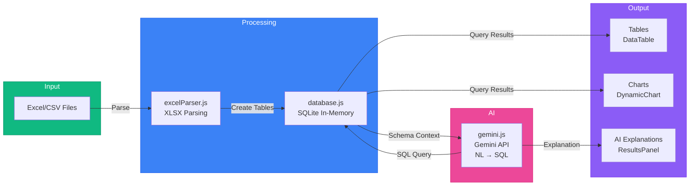
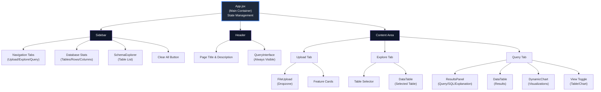
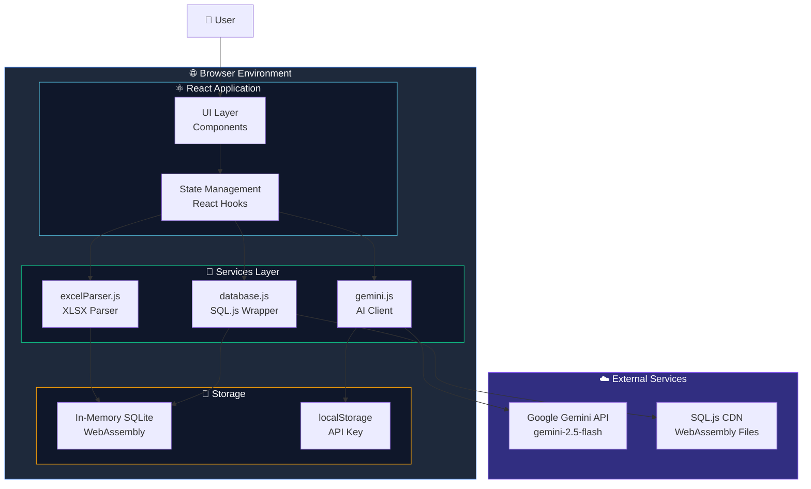
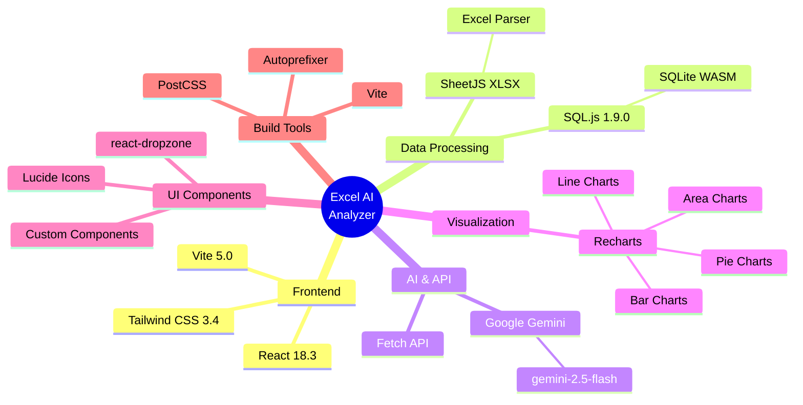
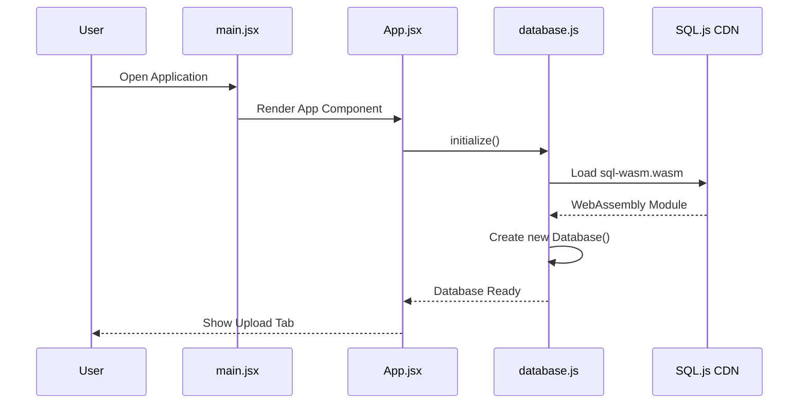
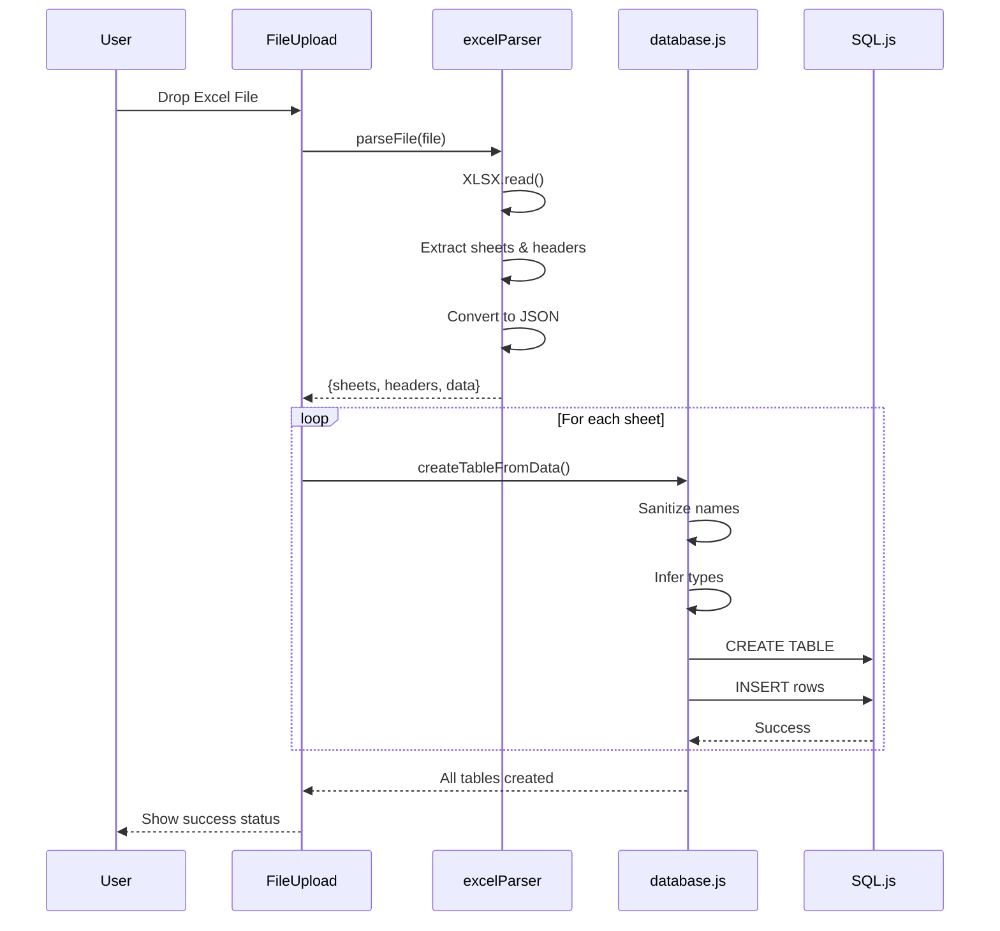
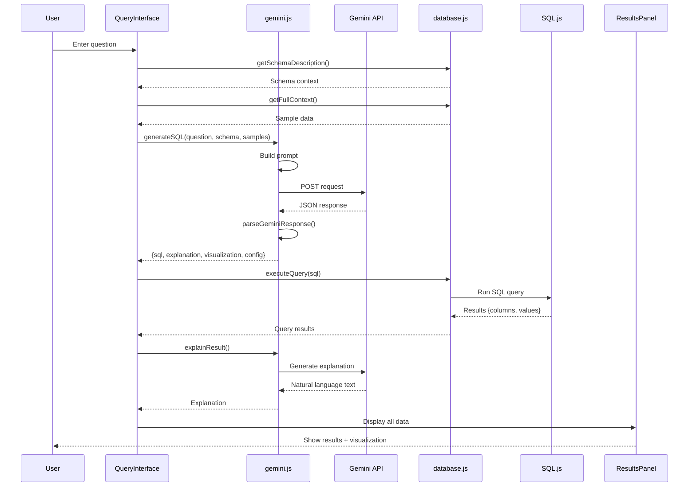
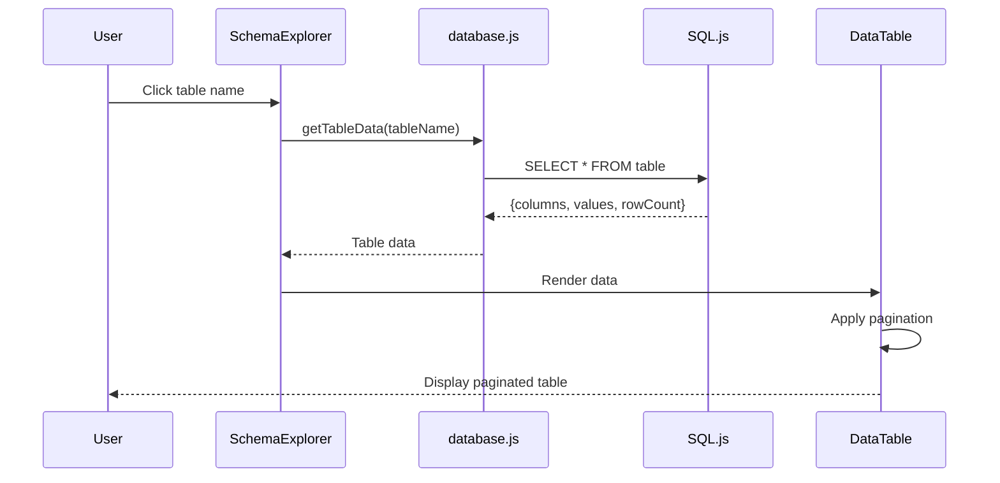
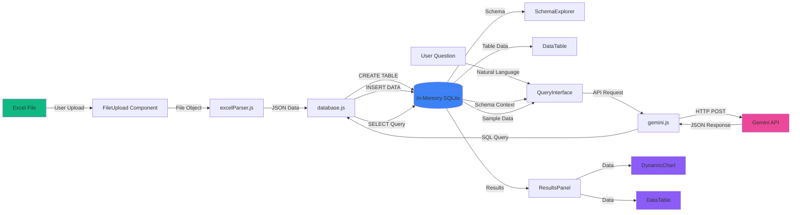

# Excel AI Analyzer - RMG Intelligence Dashboard

<div align="center">


A powerful, fully client-side Excel analysis tool that combines in-memory SQL querying with AI-powered natural language processing. Perfect for Resource Management Groups (RMG) and business analysts who need to quickly analyze data from multiple Excel files.

[Getting Started](#-getting-started) • [Features](#-features) • [Architecture](#-architecture) • [Documentation](#-complete-application-flow)

</div>

---

## 📋 Table of Contents

- [Overview](#-overview)
- [Features](#-features)
- [Getting Started](#-getting-started)
- [Complete Application Flow](#-complete-application-flow)
- [Architecture & Design](#-architecture)
- [Tools & Technologies](#-tools--technologies)
- [Services Documentation](#-services-documentation)
- [Components Documentation](#-components-documentation)
- [How It Works](#-how-it-works)
- [Data Flow](#-data-flow)
- [Constraints & Limitations](#-constraints--limitations)
- [Configuration](#%EF%B8%8F-configuration)
- [Privacy & Security](#-privacy--security)
- [Troubleshooting](#-troubleshooting)

---

## 🌟 Overview

Excel AI Analyzer is an intelligent data analysis platform that runs entirely in your browser. It transforms Excel files into a queryable SQL database and uses Google's Gemini AI to understand natural language questions, generate SQL queries, and provide insightful explanations.

### Core Capabilities

- **📊 Multi-File Upload**: Upload multiple Excel files with multiple sheets each
- **⚡ In-Memory SQL Database**: Uses SQL.js (SQLite compiled to WebAssembly) for lightning-fast queries
- **🤖 AI-Powered Natural Language Queries**: Ask questions in plain English using Google Gemini AI
- **📈 Dynamic Visualizations**: Automatic chart generation (Bar, Line, Pie, Area charts)
- **🔍 Advanced Data Exploration**: Browse tables, filter, sort, and search your data
- **💾 Export Results**: Export query results back to Excel

### Technical Highlights

- **100% Client-Side**: All processing happens in your browser - no data leaves your machine
- **No Backend Required**: Just open and use - no server deployment needed
- **Fast Performance**: SQLite in-browser handles large datasets efficiently
- **Automatic Schema Detection**: Column types are inferred automatically
- **Smart SQL Generation**: Gemini generates accurate SQL from natural language
- **Responsive UI**: Beautiful dark theme with Tailwind CSS

---

## 🌟 Features

### 1. 📤 File Upload & Processing

- **Drag & Drop Interface**: Intuitive file upload with visual feedback
- **Multi-File Support**: Upload multiple files simultaneously
- **Multi-Sheet Support**: All sheets from Excel files are automatically loaded
- **Supported Formats**: `.xlsx`, `.xls`, `.csv`, `.ods`, `.xlsb`, `.xlsm`
- **Real-Time Processing Status**: Track the progress of each file upload

### 2. 🗄️ In-Memory Database

- **SQLite in Browser**: Powered by SQL.js (SQLite compiled to WebAssembly)
- **Automatic Schema Creation**: Tables and columns created automatically from Excel data
- **Type Inference**: Automatically detects INTEGER, REAL, and TEXT types
- **Name Sanitization**: Handles special characters and creates valid SQL identifiers
- **Fast Queries**: Execute complex SQL queries in milliseconds

### 3. 🤖 AI-Powered Queries

- **Natural Language Processing**: Ask questions in plain English
- **Google Gemini Integration**: Uses Gemini 2.5 Flash Preview model
- **Context-Aware**: AI understands your database schema and data patterns
- **Suggested Questions**: Get intelligent question suggestions based on your data
- **Query History**: Track your previous queries

### 4. 📊 Data Visualization

- **Automatic Chart Selection**: AI recommends the best visualization type
- **Multiple Chart Types**:
  - 📊 Bar Charts: Compare categories
  - 📈 Line Charts: Show trends over time
  - 🥧 Pie Charts: Display proportions
  - 📉 Area Charts: Cumulative trends
- **Interactive Charts**: Powered by Recharts with tooltips and legends
- **Toggle Views**: Switch between table and chart views

### 5. 🔍 Data Exploration

- **Schema Browser**: View all tables, columns, and data types in the sidebar
- **Paginated Tables**: Browse large datasets with efficient pagination
- **Quick Table Access**: Click any table to instantly view its contents
- **Column Statistics**: See row counts and column counts at a glance

### 6. 📑 Results & Export

- **Detailed Results Panel**: Shows query, SQL, and AI explanation
- **Export to Excel**: Download query results as Excel files
- **Formatted Display**: Results presented in clean, readable tables

---

## 🚀 Getting Started

### Prerequisites

- **Node.js** 18+ ([Download](https://nodejs.org/))
- **npm** or **yarn** (comes with Node.js)
- **Google Gemini API Key** - Free from [Google AI Studio](https://aistudio.google.com/app/apikey)
- **Modern Browser** with WebAssembly support (Chrome, Firefox, Edge, Safari)

### Installation

1. **Clone or download the repository**:

   ```bash
   git clone https://github.com/jambhaleAnuj/Gemini_RMG_SQL_Analysis.git
   cd Gemini_RMG_SQL_Analysis
   ```

2. **Install dependencies**:

   ```bash
   npm install
   ```

3. **Start the development server**:

   ```bash
   npm run dev
   ```

4. **Open your browser** and navigate to:

   ```
   http://localhost:5173
   ```

5. **Configure your Gemini API key**:
   - Click on the key icon (🔑) in the query interface
   - Enter your Gemini API key
   - The key is stored securely in browser localStorage

---

## 📖 How to Use

### Step 1: Upload Your Excel Files

1. Navigate to the **"Upload Data"** tab
2. Drag and drop your Excel files (or click to browse)
3. Supported formats: `.xlsx`, `.xls`, `.csv`, `.ods`, `.xlsb`, `.xlsm`
4. The app will automatically:
   - Parse all sheets from each file
   - Create tables in the database
   - Infer column types
   - Generate suggested questions

### Step 2: Explore Your Data

1. Switch to the **"Explore Data"** tab
2. Browse the schema in the left sidebar
3. Click on any table name to view its contents
4. View table statistics (row count, column count)
5. Navigate through paginated data

### Step 3: Ask Questions in Natural Language

1. Use the query interface at the top (visible on all tabs once data is loaded)
2. Type your question in plain English, for example:
   - _"Show me all employees in the Engineering department"_
   - _"What is the total salary by department?"_
   - _"Who has the highest sales this quarter?"_
   - _"List all resources with more than 5 years of experience"_
   - _"Calculate the average age by location"_
3. Click **"Ask AI"** or press Enter
4. The system will:
   - Generate the appropriate SQL query
   - Execute it against your data
   - Recommend the best visualization
   - Explain the results in plain English

### Step 4: View Results

1. Switch to the **"Query Tab"** to see results
2. View the AI's explanation of what was found
3. See the generated SQL query (for transparency)
4. Results are displayed as:
   - **Table view**: For detailed data listings
   - **Charts**: For visual analysis (bar, line, pie, area)
5. Toggle between table and chart views
6. Export results to Excel if needed

---

## 🔄 Complete Application Flow

### High-Level Application Flow

```mermaid
flowchart TB
    subgraph Init["🚀 Application Initialization"]
        A[main.jsx] --> B[App.jsx]
        B --> C{Initialize SQL.js Database}
        C -->|Success| D[Database Ready]
        C -->|Failure| E[Show Error Message]
    end

    subgraph Upload["📤 File Upload Flow"]
        D --> F[Upload Tab Active]
        F --> G[FileUpload Component]
        G --> H[User Drops/Selects Excel Files]
        H --> I[excelParser.parseFile]
        I --> J[XLSX Library Parses File]
        J --> K[Extract Sheets & Headers]
        K --> L[Convert to JSON Data]
        L --> M[databaseService.createTableFromData]
        M --> N[Sanitize Table/Column Names]
        N --> O[Infer Column Types]
        O --> P[CREATE TABLE SQL]
        P --> Q[INSERT Data Rows]
        Q --> R[Update Tables State]
        R --> S[Generate Suggested Questions]
    end

    subgraph Explore["🔍 Data Exploration Flow"]
        R --> T[Explore Tab]
        T --> U[SchemaExplorer Component]
        U --> V[Display Table List & Columns]
        V --> W[User Clicks Table]
        W --> X[databaseService.getTableData]
        X --> Y[DataTable Component]
        Y --> Z[Render Paginated Data]
    end

    subgraph Query["💬 Natural Language Query Flow"]
        R --> AA[Query Tab]
        AA --> AB[QueryInterface Component]
        AB --> AC{API Key Configured?}
        AC -->|No| AD[Show API Key Modal]
        AD --> AE[User Enters Gemini API Key]
        AE --> AF[Save to localStorage]
        AF --> AC
        AC -->|Yes| AG[User Enters Natural Language Question]
        AG --> AH[geminiService.generateSQL]
    end

    subgraph AI["🤖 Gemini AI Processing"]
        AH --> AI[Build System Prompt with Schema Context]
        AI --> AJ[Send Request to Gemini API]
        AJ --> AK[Parse JSON Response]
        AK --> AL[Extract SQL Query]
        AK --> AM[Extract Visualization Type]
        AK --> AN[Extract Visualization Config]
    end

    subgraph Execute["⚡ Query Execution"]
        AL --> AO[databaseService.executeQuery]
        AO --> AP[Run SQL on SQLite]
        AP --> AQ[Get Result Columns & Values]
        AQ --> AR[geminiService.explainResult]
        AR --> AS[AI Generates Natural Language Explanation]
    end

    subgraph Display["📊 Results Display"]
        AS --> AT[ResultsPanel Component]
        AT --> AU[Show Query & SQL]
        AT --> AV[Show AI Explanation]
        AT --> AW{Visualization Type?}
        AW -->|table| AX[DataTable Component]
        AW -->|bar/line/pie/area| AY[DynamicChart Component]
        AY --> AZ[Recharts Library Renders Chart]
        AX --> BA[Paginated Table View]
        BA --> BB[Export Options]
    end

    style Init fill:#1e3a5f,stroke:#3b82f6,color:#fff
    style Upload fill:#1e3a5f,stroke:#10b981,color:#fff
    style Explore fill:#1e3a5f,stroke:#8b5cf6,color:#fff
    style Query fill:#1e3a5f,stroke:#f59e0b,color:#fff
    style AI fill:#1e3a5f,stroke:#ec4899,color:#fff
    style Execute fill:#1e3a5f,stroke:#14b8a6,color:#fff
    style Display fill:#1e3a5f,stroke:#6366f1,color:#fff
```

### Simplified Data Flow



### Component Hierarchy



---

## 🏗️ Architecture

### System Architecture Diagram



### Technology Stack



---

## 🛠️ Tools & Technologies

### Core Technologies

| Technology         | Version    | Purpose                                                |
| ------------------ | ---------- | ------------------------------------------------------ |
| **React**          | 18.3.1     | UI framework for component-based architecture          |
| **Vite**           | 5.0.8      | Fast build tool and development server                 |
| **SQL.js**         | 1.9.0      | SQLite compiled to WebAssembly for in-browser database |
| **SheetJS (XLSX)** | 0.18.5     | Excel file parsing and manipulation                    |
| **Google Gemini**  | API v1beta | AI model for natural language processing               |

### UI & Styling

| Technology       | Version | Purpose                            |
| ---------------- | ------- | ---------------------------------- |
| **Tailwind CSS** | 3.4.1   | Utility-first CSS framework        |
| **PostCSS**      | 8.4.35  | CSS processing and autoprefixing   |
| **Lucide React** | 0.263.1 | Beautiful, consistent icon library |

### Data Visualization

| Technology   | Version | Purpose                                 |
| ------------ | ------- | --------------------------------------- |
| **Recharts** | 2.10.3  | Composable charting library built on D3 |

### File Handling

| Technology         | Version | Purpose                           |
| ------------------ | ------- | --------------------------------- |
| **react-dropzone** | 14.2.3  | Drag & drop file upload interface |

### Development Tools

| Tool                | Purpose                      |
| ------------------- | ---------------------------- |
| **ESLint**          | Code quality and consistency |
| **Vite Dev Server** | Hot module replacement (HMR) |
| **npm/yarn**        | Package management           |

---

## 📦 Services Documentation

### 1. database.js - SQL Database Service

**Purpose**: Manages the in-memory SQLite database using SQL.js

**Key Methods**:

```javascript
class DatabaseService {
  // Initialize SQL.js database from CDN
  async initialize()

  // Create table from Excel data with automatic schema
  createTableFromData(tableName, data, originalColumns)

  // Execute SQL query and return results
  executeQuery(sql)

  // Get data from specific table
  getTableData(tableName, limit = 1000)

  // Get all tables with schema information
  getAllTablesInfo()

  // Get schema description for AI context
  getSchemaDescription()

  // Get full context (schema + sample data) for AI
  getFullContext(sampleRowsPerTable = 3)

  // Clear all data and reset database
  clearAll()

  // Utility methods
  sanitizeName(name)        // Clean table/column names
  inferType(value)           // Infer SQL data type
  inferColumnTypes(data)     // Analyze data for types
}
```

**Features**:

- ✅ Automatic type inference (INTEGER, REAL, TEXT)
- ✅ Name sanitization (handles special characters, spaces, numbers)
- ✅ Duplicate column name handling
- ✅ Primary key auto-increment
- ✅ NULL value handling
- ✅ Schema introspection
- ✅ Sample data extraction for AI context

**Type Inference Logic**:

```javascript
// Numbers with no decimals → INTEGER
// Numbers with decimals → REAL
// Dates, text, everything else → TEXT
// Null/Empty → TEXT (default)
```

### 2. gemini.js - AI Service

**Purpose**: Interfaces with Google Gemini API for natural language to SQL conversion

**Key Methods**:

```javascript
class GeminiService {
  // Set and persist API key
  setApiKey(key)
  getApiKey()
  clearApiKey()

  // Generate SQL from natural language question
  async generateSQL(question, schemaContext, sampleData)

  // Generate natural language explanation of results
  async explainResult(question, sql, results, schemaContext)

  // Generate suggested questions based on schema
  async suggestQuestions(schemaContext, count = 5)

  // Parse Gemini's JSON response
  parseGeminiResponse(text)
}
```

**API Configuration**:

- **Model**: `gemini-2.5-flash-preview-09-2025`
- **Endpoint**: `https://generativelanguage.googleapis.com/v1beta/models`
- **Temperature**: 0.1 (low randomness for consistent SQL)
- **Max Tokens**: 2048

**Prompt Engineering**:

The service sends a detailed system prompt to Gemini containing:

1. **Rules**: SQL syntax requirements, naming conventions
2. **Schema**: Complete table and column structure
3. **Sample Data**: 3 rows from each table for context
4. **Format**: Required JSON response structure

**Response Format**:

```json
{
  "sql": "SELECT ...",
  "explanation": "This query...",
  "visualization": "bar|line|pie|area|table",
  "visualizationConfig": {
    "xField": "column_name",
    "yField": "column_name",
    "groupField": "optional_column"
  }
}
```

### 3. excelParser.js - Excel File Parser

**Purpose**: Parse Excel/CSV files into structured JSON data

**Key Methods**:

```javascript
class ExcelParser {
  // Parse single file
  async parseFile(file)

  // Parse multiple files
  async parseFiles(files)

  // Export data to Excel
  exportToExcel(data, columns, fileName)

  // Export query results to Excel
  exportQueryResults(results, fileName)

  // Validation
  isValidFile(file)
  getSupportedExtensions()
}
```

**Parsing Features**:

- ✅ Multi-sheet support
- ✅ Automatic header detection
- ✅ Handles missing/unnamed columns
- ✅ Type conversion (dates, numbers)
- ✅ Empty row filtering
- ✅ Comma removal from numbers
- ✅ Date formatting (ISO 8601)

**Supported Formats**:

- `.xlsx` - Excel 2007+
- `.xls` - Excel 97-2003
- `.csv` - Comma-separated values
- `.ods` - OpenDocument Spreadsheet
- `.xlsb` - Excel Binary
- `.xlsm` - Excel Macro-enabled

---

## 🧩 Components Documentation

### 1. App.jsx - Main Application Container

**Purpose**: Root component managing application state and routing

**State Management**:

```javascript
const [isDbInitialized, setIsDbInitialized]      // Database ready status
const [tables, setTables]                         // List of loaded tables
const [selectedTable, setSelectedTable]           // Currently viewed table
const [tableData, setTableData]                   // Data for selected table
const [queryResults, setQueryResults]             // Query execution results
const [currentQuery, setCurrentQuery]             // User's natural language question
const [currentSql, setCurrentSql]                 // Generated SQL query
const [explanation, setExplanation]               // AI explanation
const [visualization, setVisualization]           // Chart type
const [visualizationConfig, setVisualizationConfig] // Chart configuration
const [activeTab, setActiveTab]                   // Current tab (upload/explore/query)
const [suggestedQuestions, setSuggestedQuestions] // AI-generated suggestions
```

**Key Functions**:

- `handleFilesProcessed()` - Process uploaded files
- `handleQuery()` - Execute natural language query
- `handleTableClick()` - View table data
- `refreshSuggestions()` - Get new question suggestions
- `handleClearAll()` - Reset application state

### 2. FileUpload.jsx - File Upload Component

**Purpose**: Drag & drop file upload interface with status tracking

**Features**:

- 📤 Drag & drop zone with visual feedback
- 📋 File list with processing status
- ✅ Real-time status updates (pending/processing/success/error)
- 🗑️ Individual file removal
- 📊 File size display

**Status States**:

- `pending` - File added, not yet processed
- `processing` - Currently being parsed/loaded
- `success` - Successfully loaded into database
- `error` - Failed with error message

### 3. QueryInterface.jsx - Natural Language Input

**Purpose**: Query input with API key management and suggestions

**Features**:

- 🔑 API key configuration modal
- 💬 Natural language input field
- 💡 Suggested questions based on data
- 📜 Query history (last 5 queries)
- 🔄 Refresh suggestions button
- ✨ Visual loading states

### 4. DataTable.jsx - Data Display Component

**Purpose**: Paginated table display with search and filtering

**Features**:

- 📄 Pagination (configurable page size)
- 🔍 Global search across all columns
- ⬆️⬇️ Column sorting
- 📊 Row count display
- 💾 Export to Excel
- 🎨 Responsive design

### 5. DynamicChart.jsx - Visualization Component

**Purpose**: Render different chart types using Recharts

**Supported Charts**:

- 📊 **Bar Chart**: Compare categories
- 📈 **Line Chart**: Show trends
- 🥧 **Pie Chart**: Display proportions
- 📉 **Area Chart**: Cumulative trends

**Features**:

- 🎨 Gradient fills
- 🏷️ Interactive tooltips
- 📊 Legend
- 🎯 Automatic axis configuration
- 🔄 Chart type switcher

### 6. SchemaExplorer.jsx - Database Schema Browser

**Purpose**: Display database structure in sidebar

**Features**:

- 📁 Collapsible table list
- 📊 Column names and types
- 🔢 Row counts
- 🎯 Click to view table data
- 🎨 Type-based icons (INTEGER/REAL/TEXT)

### 7. ResultsPanel.jsx - Query Results Display

**Purpose**: Show query information and AI explanation

**Features**:

- 💬 User's original question
- 📝 Generated SQL query (with syntax highlighting)
- 🤖 AI explanation of results
- 📊 Result count
- ⏱️ Loading states

---

## 🔄 How It Works

### Detailed Workflow

#### Phase 1: Initialization (App Start)



#### Phase 2: File Upload & Processing



#### Phase 3: Natural Language Query



#### Phase 4: Data Exploration



---

## 📊 Data Flow

### File Upload to Query - Complete Flow



---

## ⚠️ Constraints & Limitations

### Technical Constraints

| Constraint              | Details                      | Impact                                            |
| ----------------------- | ---------------------------- | ------------------------------------------------- |
| **Browser Memory**      | SQLite database lives in RAM | Large files (>100MB) may cause performance issues |
| **WebAssembly Support** | Requires modern browser      | Won't work on very old browsers                   |
| **Single Session**      | Data is lost on page refresh | No persistent storage (by design for privacy)     |
| **API Rate Limits**     | Gemini API has rate limits   | Free tier: ~60 requests/minute                    |
| **SQL.js Limitations**  | Single-threaded execution    | Very complex queries may block UI briefly         |

### Data Limitations

| Limitation        | Details                               | Recommendation                    |
| ----------------- | ------------------------------------- | --------------------------------- |
| **File Size**     | Recommended <50MB per file            | Split large files or use CSV      |
| **Row Count**     | Works well with <100,000 rows         | Filter data before upload         |
| **Column Count**  | Recommended <100 columns per table    | Split wide tables if possible     |
| **String Length** | Long text fields (>10KB) slow queries | Keep text fields reasonably sized |
| **Date Formats**  | Must be parseable by JavaScript Date  | Use ISO 8601 format (YYYY-MM-DD)  |

### AI Query Limitations

| Limitation               | Details                       | Workaround                                   |
| ------------------------ | ----------------------------- | -------------------------------------------- |
| **Context Window**       | Gemini has token limits       | Schema + 3 sample rows per table             |
| **SQL Accuracy**         | AI may generate incorrect SQL | Review generated SQL before trusting results |
| **Complex Queries**      | Very complex joins may fail   | Break into simpler questions                 |
| **Ambiguous Questions**  | Vague questions get vague SQL | Be specific in your questions                |
| **Schema Understanding** | AI needs clear column names   | Use descriptive headers in Excel             |

### Security & Privacy Constraints

| Constraint            | Details                                | Mitigation                           |
| --------------------- | -------------------------------------- | ------------------------------------ |
| **API Key Storage**   | Stored in localStorage (not encrypted) | Don't use on shared computers        |
| **Data Privacy**      | Schema + samples sent to Gemini        | Don't use with highly sensitive data |
| **HTTPS Required**    | API calls need secure connection       | Always use HTTPS in production       |
| **CORS Restrictions** | Browser security policies              | SQL.js loaded from CDN               |

### Browser Compatibility

| Browser     | Minimum Version  | Notes              |
| ----------- | ---------------- | ------------------ |
| **Chrome**  | 91+              | ✅ Fully supported |
| **Firefox** | 89+              | ✅ Fully supported |
| **Edge**    | 91+              | ✅ Fully supported |
| **Safari**  | 15+              | ✅ Fully supported |
| **Opera**   | 77+              | ✅ Fully supported |
| **IE**      | ❌ Not supported | No WebAssembly     |

### Known Issues

1. **Large File Upload**: Files >100MB may freeze the browser temporarily
2. **Memory Leaks**: Long sessions with many queries may slow down
3. **Mobile Browsers**: Limited by device RAM, not recommended for large datasets
4. **Visualization Limits**: Pie charts recommended for <10 categories
5. **Date Parsing**: Non-standard date formats may be treated as text

### Best Practices

✅ **Do**:

- Use well-formatted Excel files with clear headers
- Keep files under 50MB when possible
- Ask specific, clear questions
- Review generated SQL before using results
- Export important results (data is not persisted)
- Use descriptive column names

❌ **Don't**:

- Upload highly sensitive or confidential data
- Expect results to persist after refresh
- Use on untrusted networks with sensitive API keys
- Upload files with >1 million rows
- Rely solely on AI-generated SQL without verification

---

## 📁 Project Structure

```
new_claude_gemini_sql/
├── index.html                      # Entry HTML file (loads Vite)
├── package.json                    # Dependencies and scripts
├── package-lock.json               # Locked dependency versions
├── vite.config.js                  # Vite build configuration
├── tailwind.config.js              # Tailwind CSS customization
├── postcss.config.js               # PostCSS plugins
├── README.md                       # This file
│
└── src/
    ├── main.jsx                    # React entry point, renders App
    ├── App.jsx                     # Main application container
    ├── index.css                   # Global styles (Tailwind imports)
    │
    ├── components/                 # React UI components
    │   ├── FileUpload.jsx          # Drag & drop file upload
    │   ├── DataTable.jsx           # Paginated data table display
    │   ├── QueryInterface.jsx      # Natural language query input
    │   ├── DynamicChart.jsx        # Chart visualization (Recharts)
    │   ├── SchemaExplorer.jsx      # Database schema sidebar
    │   └── ResultsPanel.jsx        # Query results and explanation
    │
    ├── services/                   # Business logic services
    │   ├── database.js             # SQL.js database wrapper
    │   └── gemini.js               # Gemini AI API client
    │
    └── utils/                      # Utility functions
        └── excelParser.js          # Excel/CSV file parsing
```

### Key Files Explained

#### Configuration Files

- **vite.config.js**: Vite bundler settings, plugins, server config
- **tailwind.config.js**: Custom colors, themes, dark mode configuration
- **postcss.config.js**: CSS processing pipeline (Tailwind, Autoprefixer)
- **package.json**: Dependencies, scripts (`dev`, `build`, `preview`)

#### Source Files

- **main.jsx**: React application entry point, ReactDOM.render()
- **App.jsx**: Main component with state management and routing logic
- **index.css**: Tailwind directives, custom CSS variables, global styles

#### Component Responsibilities

| Component          | Responsibility            | Key Features                             |
| ------------------ | ------------------------- | ---------------------------------------- |
| **FileUpload**     | File selection and upload | Drag & drop, multi-file, status tracking |
| **DataTable**      | Display tabular data      | Pagination, search, sorting, export      |
| **QueryInterface** | Natural language input    | API key modal, suggestions, history      |
| **DynamicChart**   | Data visualization        | Bar, line, pie, area charts              |
| **SchemaExplorer** | Show database schema      | Collapsible tree, type icons             |
| **ResultsPanel**   | Query results display     | SQL, explanation, metrics                |

#### Service Responsibilities

| Service            | Responsibility             | Key Methods                                   |
| ------------------ | -------------------------- | --------------------------------------------- |
| **database.js**    | SQLite database operations | initialize, createTableFromData, executeQuery |
| **gemini.js**      | AI API communication       | generateSQL, explainResult, suggestQuestions  |
| **excelParser.js** | File parsing               | parseFile, exportToExcel                      |

---

## ⚙️ Configuration

### Environment Setup

No `.env` file needed! The API key is stored in browser localStorage.

### Gemini API Configuration

**Location**: [src/services/gemini.js](src/services/gemini.js#L2)

```javascript
const API_ENDPOINT = "https://generativelanguage.googleapis.com/v1beta/models";
const MODEL_ID = "gemini-2.5-flash-preview-09-2025";
```

**Available Models**:

- `gemini-2.5-flash-preview-09-2025` - Fast, efficient (default)
- `gemini-1.5-pro` - More powerful, slower
- `gemini-1.5-flash` - Balanced option

**API Key Setup**:

1. Visit [Google AI Studio](https://aistudio.google.com/app/apikey)
2. Create a new API key
3. Enter it in the application's key modal (🔑 icon)

### SQL.js Configuration

**Location**: [src/services/database.js](src/services/database.js#L20)

```javascript
const SQL = await window.initSqlJs({
  locateFile: (file) =>
    `https://cdnjs.cloudflare.com/ajax/libs/sql.js/1.9.0/${file}`,
});
```

**CDN Options**:

- Current: CloudFlare CDN (fast, reliable)
- Alternative: Load locally from `node_modules` for offline use

### Vite Development Server

**Location**: [vite.config.js](vite.config.js)

```javascript
export default defineConfig({
  plugins: [react()],
  server: {
    port: 5173,
    open: true,
  },
});
```

### Tailwind Theme Customization

**Location**: [tailwind.config.js](tailwind.config.js)

```javascript
theme: {
  extend: {
    colors: {
      primary: { /* Custom blue shades */ },
      dark: { /* Dark theme grays */ },
    },
  },
}
```

### Build Commands

```bash
# Development (hot reload)
npm run dev

# Production build
npm run build

# Preview production build
npm run preview

# Lint code
npm run lint
```

---

## 🔒 Privacy & Security

### Data Privacy

✅ **What stays private**:

- ✅ Your Excel file data never leaves your browser
- ✅ All SQL queries run locally in WebAssembly
- ✅ No data is sent to any backend server
- ✅ Complete data isolation

⚠️ **What is shared with Google**:

- ⚠️ Database schema (table and column names)
- ⚠️ 3 sample rows from each table (for AI context)
- ⚠️ Your natural language questions
- ⚠️ Generated SQL queries (for explanation)

❌ **Never shared**:

- ❌ Full dataset contents
- ❌ Sensitive cell values (beyond samples)
- ❌ Query results

### Security Measures

| Measure              | Implementation           | Purpose                 |
| -------------------- | ------------------------ | ----------------------- |
| **Client-Side Only** | No backend server        | No data transmission    |
| **HTTPS Required**   | API calls use HTTPS      | Encrypted communication |
| **localStorage**     | API key stored locally   | No server-side storage  |
| **No Cookies**       | No tracking cookies      | Privacy compliance      |
| **No Analytics**     | No telemetry or tracking | Complete privacy        |

### API Key Security

⚠️ **Important Notes**:

- API keys are stored in **browser localStorage** (unencrypted)
- Don't use this on shared or public computers
- Clear localStorage before using public computers
- Regenerate API keys if compromised

**To clear API key**:

```javascript
// Open browser console (F12) and run:
localStorage.removeItem("gemini_api_key");
```

### Best Practices for Sensitive Data

1. **Don't upload**:

   - Personally Identifiable Information (PII)
   - Financial records
   - Medical records
   - Confidential business data

2. **Do use for**:

   - Public datasets
   - Anonymized data
   - Sample/test data
   - Non-sensitive business analytics

3. **Consider**:
   - Removing sensitive columns before upload
   - Using sample/subset of data
   - Anonymizing names and identifiers

---

## 🐛 Troubleshooting

### Common Issues & Solutions

#### 1. "Failed to initialize database"

**Symptoms**: Error message on app start, database won't load

**Causes**:

- WebAssembly not supported
- SQL.js CDN blocked or down
- Browser compatibility issue

**Solutions**:

```bash
# Update browser to latest version
# Check browser console (F12) for errors
# Try clearing cache: Ctrl+Shift+Delete
# Try a different browser
```

#### 2. "API Error" / Gemini Not Responding

**Symptoms**: Query fails with API error, no results returned

**Causes**:

- Invalid or expired API key
- Rate limit exceeded
- No internet connection
- API quota exhausted

**Solutions**:

```bash
# Verify API key at: https://aistudio.google.com/app/apikey
# Check internet connection
# Wait 1 minute if rate limited
# Generate new API key if needed
```

#### 3. File Upload Fails

**Symptoms**: File doesn't process, stuck on "processing" status

**Causes**:

- Unsupported file format
- Corrupted file
- File too large (>100MB)
- Invalid Excel structure

**Solutions**:

```bash
# Verify file extension (.xlsx, .xls, .csv)
# Try opening file in Excel first
# Split large files into smaller ones
# Re-save file as .xlsx format
```

#### 4. Slow Performance / Browser Freeze

**Symptoms**: App becomes unresponsive, queries take forever

**Causes**:

- Too much data loaded (>100,000 rows)
- Complex queries with multiple JOINs
- Memory exhaustion
- Too many tables loaded

**Solutions**:

```bash
# Clear all data and reload smaller dataset
# Use "Clear All Data" button
# Close and reopen browser
# Upgrade browser/computer RAM
# Filter data before uploading
```

#### 5. Chart Not Displaying

**Symptoms**: Visualization shows "table" instead of chart

**Causes**:

- Data not suitable for chart type
- Missing required fields
- Too many data points (>100)
- All null values

**Solutions**:

```bash
# Try different chart type
# Check data has numeric values
# Filter to fewer rows
# Verify column names in data
```

#### 6. SQL Query Errors

**Symptoms**: "SQL execution error", incorrect results

**Causes**:

- AI generated invalid SQL
- Table/column names mismatch
- Type mismatch in query
- Missing quotes around names

**Solutions**:

```bash
# Review generated SQL (shown in results)
# Rephrase question more specifically
# Check table/column names in sidebar
# Ask simpler questions
```

### Debug Mode

Enable debug logging in browser console (F12):

```javascript
// In browser console
localStorage.setItem("DEBUG", "true");

// Disable debug mode
localStorage.removeItem("DEBUG");
```

### Performance Optimization Tips

1. **Upload Optimization**:

   - Use CSV instead of XLSX (faster parsing)
   - Remove unnecessary columns
   - Limit rows to what you need

2. **Query Optimization**:

   - Be specific in questions
   - Use filters to limit results
   - Avoid SELECT \* on large tables

3. **Browser Optimization**:
   - Close unused tabs
   - Use Chrome/Edge for best performance
   - Increase browser memory limit

### Getting Help

**Check logs**:

1. Open browser DevTools (F12)
2. Go to Console tab
3. Look for error messages (red text)
4. Copy error for debugging

**Report Issues**:

- GitHub Issues: [Report a bug](https://github.com/jambhaleAnuj/Gemini_RMG_SQL_Analysis/issues)
- Include: Browser version, error message, steps to reproduce

---

## 📚 Additional Resources

### Learning Resources

- [SQL.js Documentation](https://sql.js.org/)
- [Google Gemini API Docs](https://ai.google.dev/docs)
- [React Documentation](https://react.dev/)
- [Tailwind CSS Docs](https://tailwindcss.com/docs)
- [Recharts Examples](https://recharts.org/en-US/examples)

### Related Projects

- [SheetJS Community Edition](https://docs.sheetjs.com/)
- [Vite Documentation](https://vitejs.dev/)
- [SQLite Documentation](https://www.sqlite.org/docs.html)

---

## 📜 License

MIT License - Feel free to use, modify, and distribute this project!

```
MIT License

Copyright (c) 2025 Anuj Jambhale

Permission is hereby granted, free of charge, to any person obtaining a copy
of this software and associated documentation files (the "Software"), to deal
in the Software without restriction, including without limitation the rights
to use, copy, modify, merge, publish, distribute, sublicense, and/or sell
copies of the Software, and to permit persons to whom the Software is
furnished to do so, subject to the following conditions:

The above copyright notice and this permission notice shall be included in all
copies or substantial portions of the Software.

THE SOFTWARE IS PROVIDED "AS IS", WITHOUT WARRANTY OF ANY KIND, EXPRESS OR
IMPLIED, INCLUDING BUT NOT LIMITED TO THE WARRANTIES OF MERCHANTABILITY,
FITNESS FOR A PARTICULAR PURPOSE AND NONINFRINGEMENT. IN NO EVENT SHALL THE
AUTHORS OR COPYRIGHT HOLDERS BE LIABLE FOR ANY CLAIM, DAMAGES OR OTHER
LIABILITY, WHETHER IN AN ACTION OF CONTRACT, TORT OR OTHERWISE, ARISING FROM,
OUT OF OR IN CONNECTION WITH THE SOFTWARE OR THE USE OR OTHER DEALINGS IN THE
SOFTWARE.
```

---

## 🙏 Acknowledgments

This project leverages several amazing open-source technologies and APIs:

### Core Technologies

- **[SQL.js](https://sql.js.org/)** - SQLite compiled to WebAssembly for in-browser database
- **[Google Gemini](https://ai.google.dev/)** - Advanced AI for natural language processing
- **[React](https://react.dev/)** - UI library for building component-based interfaces
- **[Vite](https://vitejs.dev/)** - Next-generation frontend build tool

### Data Processing

- **[SheetJS (xlsx)](https://sheetjs.com/)** - Excel file reading and writing
- **[SQLite](https://www.sqlite.org/)** - Embedded SQL database engine

### UI Components & Styling

- **[Tailwind CSS](https://tailwindcss.com/)** - Utility-first CSS framework
- **[Recharts](https://recharts.org/)** - Composable charting library built on React and D3
- **[Lucide Icons](https://lucide.dev/)** - Beautiful, consistent icon library
- **[react-dropzone](https://react-dropzone.js.org/)** - Drag & drop file upload

### Development Tools

- **[ESLint](https://eslint.org/)** - JavaScript linting
- **[PostCSS](https://postcss.org/)** - CSS processing
- **[Autoprefixer](https://github.com/postcss/autoprefixer)** - CSS vendor prefixing

---

## 👨‍💻 Author

**Anuj Jambhale**

- GitHub: [@jambhaleAnuj](https://github.com/jambhaleAnuj)
- Repository: [Gemini_RMG_SQL_Analysis](https://github.com/jambhaleAnuj/Gemini_RMG_SQL_Analysis)

---

## 🌟 Star This Project

If you find this project useful, please consider giving it a ⭐ on GitHub!

---

## 📊 Project Stats


---

<div align="center">

**Made with ❤️ for Resource Management Groups and Data Analysts**

[⬆ Back to Top](#excel-ai-analyzer---rmg-intelligence-dashboard)

</div>
